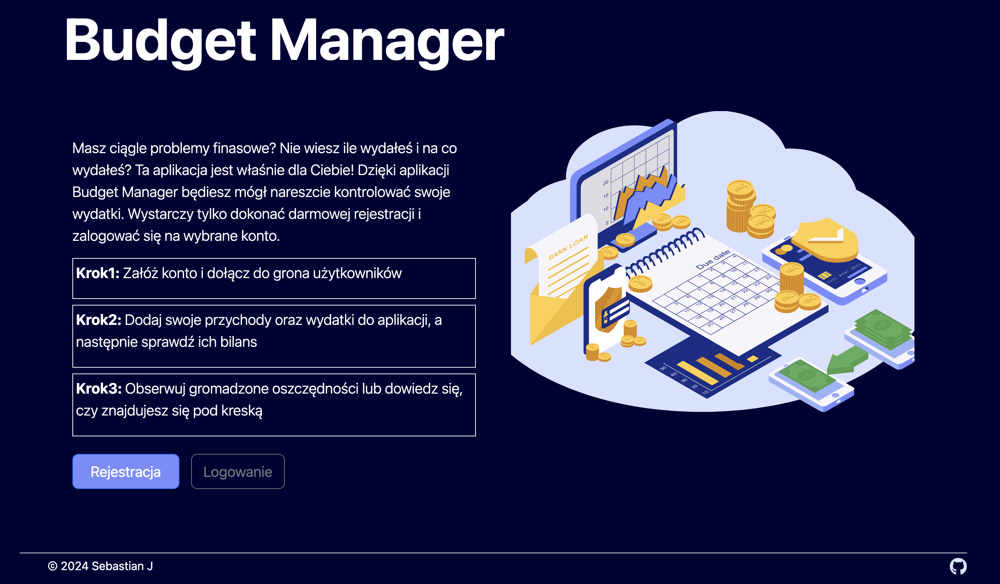

## Table of contents

- [Overview](#overview)
  - [The challenge](#the-challenge)
  - [Screenshot](#screenshot)
  - [Links](#links)
- [My process](#my-process)
  - [Built with](#built-with)
  - [What I learned](#what-i-learned)
- [Author](#author)

## Overview

### The challenge

Users should be able to:

- Register and log in to manage their personal budget.
- Add income and expenses.
- View their financial balance.
- Track savings or deficits in real-time.

### Screenshot

  
## My process

### Built with

- HTML5 for structuring the app's content.
- CSS3 and Bootstrap 5.3 for styling and responsive design.
- JavaScript for handling user interactions and budget management logic.
- SVG images for visual elements like the budget graphic.

### What I learned

During this project, I improved my skills in:

- Responsive Design: Using Bootstrap's grid system and media queries for a fluid, mobile-first design.
- JavaScript: Implementing core budget management functionalities such as adding, updating, and tracking incomes and expenses.
- User Experience: Streamlining the user registration and login process to create an intuitive interface for managing personal finances.

## Author

- GitHub - [@yourusername](https://github.com/SebastianJast)
- Website - [Sebastian](https://sebastianjast.github.io/Responsive_CV/)
